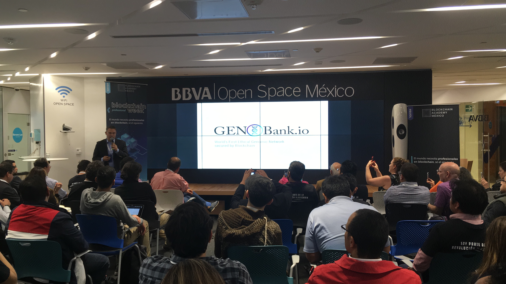

# ¿Qué es un Meetup?

Un Meetup es aquel evento donde se reúnen personas con un mismo interés. El vocero o conferencista previamente prepara una presentación para dar una charla técnica o teórica en frente de la audiencia.

Por lo general, los Meetups suelen ser grupos pequeños pero, para fines logísticos nuestros, consideramos otros eventos que suelen ser de mayor magnitud \(como conferencias\) dentro de la categoría de un Meetup.  

## Objetivo de un Meetup 

* Generar conocimiento.
* Exponer la tecnología.
* Contrarrestar la desinformación.
* Llegamos a más comunidades

### Características de un Meetup

| Característica | Descripción |
| :--- | :--- |
| **Modalidad** | Presencial |
| **Duración** | de 30 mins hasta 3 horas |
| **Contenido** | Técnico o Teórico |
| **Ubicación** | Salón, Auditorio, Terraza, etc... |
| **Asistencia** | de 10 personas en adelante |
| **Audiencia** | Cualquier perfil |

**Características generales**

* Charlas de una a dos horas.
* Evento privado o abierto al público.
* Impacto en el talento humano.

